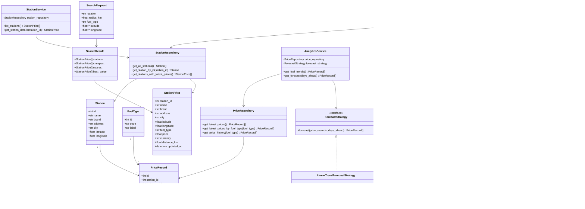
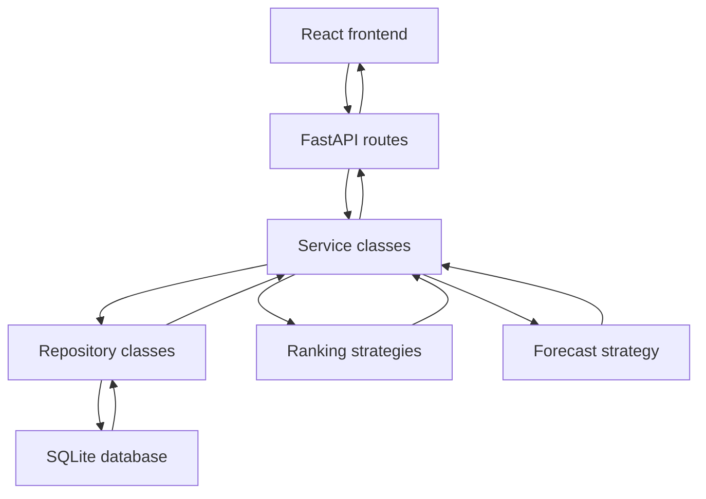
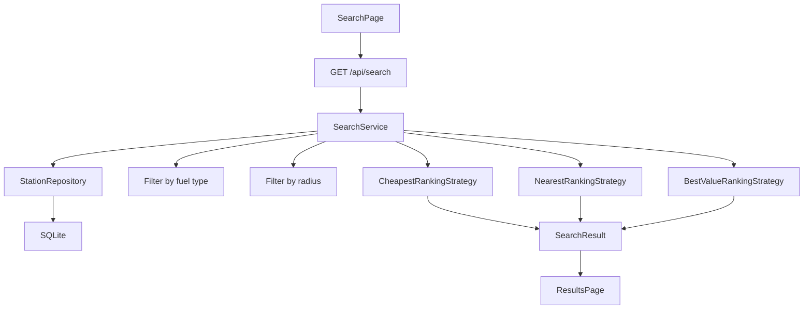

# FuelFinder Backend Design

## Purpose
This document describes the planned backend architecture for FuelFinder.

The backend should be built with:
- Python;
- FastAPI;
- SQLite for local coursework development;
- object-oriented service, repository, and algorithm layers.

The backend must be portable enough to run:
- locally on a development computer;
- on a second computer used as a small server;
- later inside Docker on a cloud VM.

## Backend Goals

The backend will replace the current frontend mock data.

Main goals:
- provide station data to the frontend;
- store stations and fuel prices in a database;
- run search logic on the backend;
- calculate ranking results;
- provide analytics and forecast data;
- keep business logic clear for coursework explanation.

## Planned Folder Structure

```text
backend/
  app/
    main.py
    config.py
    database.py

    routes/
      health_routes.py
      station_routes.py
      search_routes.py
      analytics_routes.py

    schemas/
      station_schema.py
      search_schema.py
      analytics_schema.py

    models/
      station_model.py
      fuel_type_model.py
      price_record_model.py

    repositories/
      station_repository.py
      price_repository.py

    services/
      station_service.py
      search_service.py
      analytics_service.py

    algorithms/
      ranking_strategy.py
      forecast_strategy.py

  data/
    fuelfinder.db

  tests/
    test_health.py
    test_station_service.py
    test_search_service.py
    test_ranking_strategy.py

  requirements.txt
  Dockerfile
```

## Layer Responsibilities

### Routes
Routes are the HTTP layer.

Responsibilities:
- receive API requests;
- validate request parameters through FastAPI and Pydantic;
- call service classes;
- return response schemas.

Routes should not contain ranking, database, or forecast logic.

### Schemas
Schemas are Pydantic API models.

Responsibilities:
- describe request and response shapes;
- keep frontend/backend contracts clear;
- convert Python objects into JSON-friendly responses.

### Models
Models represent database entities.

Responsibilities:
- describe database rows;
- keep table fields clear;
- support repository queries.

### Repositories
Repositories are the database access layer.

Responsibilities:
- read and write database data;
- hide SQL or ORM details from services;
- return domain objects or schema-ready data.

### Services
Services are the business logic layer.

Responsibilities:
- coordinate repositories;
- call ranking and forecast algorithms;
- prepare data for routes;
- keep application behavior in one understandable place.

### Algorithms
Algorithms contain reusable strategy classes.

Responsibilities:
- rank stations;
- calculate best-value score;
- forecast fuel prices;
- keep algorithms testable without FastAPI or database.

## Planned API Endpoints

```text
GET /health
GET /api/stations
GET /api/search
GET /api/analytics/fuel-trends
GET /api/analytics/forecast
```

### GET /health
Checks whether the backend is running.

Example response:

```json
{
  "status": "ok"
}
```

### GET /api/stations
Returns all stations with current fuel price information.

Used by:
- StationsPage;
- MapPage.

### GET /api/search
Searches stations by:
- location text;
- optional latitude and longitude;
- radius in kilometers;
- fuel type.

Returns:
- matching stations;
- cheapest top results;
- nearest top results;
- best-value top results.

### GET /api/analytics/fuel-trends
Returns recent fuel price history.

Used by:
- AnalyticsPage history card.

### GET /api/analytics/forecast
Returns forecast data for the next 3 days.

Used by:
- AnalyticsPage forecast card.

## Database Design

SQLite is planned for local development and coursework simplicity.

### stations

```text
id
name
brand
address
city
latitude
longitude
```

### fuel_types

```text
id
code
label
```

Example values:
- diesel;
- petrol95;
- petrol98;
- lpg;
- diesel_plus;
- electric.

### price_records

```text
id
station_id
fuel_type_id
price
currency
updated_at
```

This structure is more realistic than the current frontend mock data.
One station can have many price records for different fuel types.

## Main Domain Classes

```text
Station
FuelType
PriceRecord
SearchRequest
SearchResult
StationRepository
PriceRepository
StationService
SearchService
AnalyticsService
RankingStrategy
CheapestRankingStrategy
NearestRankingStrategy
BestValueRankingStrategy
ForecastStrategy
LinearTrendForecastStrategy
```

## Class Responsibilities

### Station
Represents one fuel station.

Fields:
- id;
- name;
- brand;
- address;
- city;
- latitude;
- longitude.

### FuelType
Represents a fuel type.

Fields:
- id;
- code;
- label.

### PriceRecord
Represents one station price for one fuel type at one update time.

Fields:
- id;
- station id;
- fuel type id;
- price;
- currency;
- updated at.

### SearchRequest
Represents search input from the frontend.

Fields:
- location;
- radiusKm;
- fuelType;
- optional latitude;
- optional longitude.

### SearchResult
Represents backend search output.

Contains:
- matching stations;
- cheapest stations;
- nearest stations;
- best-value stations.

### StationRepository
Reads station data from the database.

Main methods:
- `get_all_stations()`;
- `get_station_by_id(station_id)`;
- `get_stations_with_latest_prices()`.

### PriceRepository
Reads fuel price data from the database.

Main methods:
- `get_latest_prices()`;
- `get_latest_prices_by_fuel_type(fuel_type)`;
- `get_price_history(fuel_type)`.

### StationService
Prepares station data for API responses.

Main methods:
- `list_stations()`;
- `get_station_details(station_id)`.

### SearchService
Runs station search logic.

Main methods:
- `search(request)`;
- `filter_by_fuel_type(stations, fuel_type)`;
- `filter_by_radius(stations, request)`.

### AnalyticsService
Prepares fuel analytics data.

Main methods:
- `get_fuel_trends()`;
- `get_forecast(days_ahead)`.

### RankingStrategy
Base interface for station ranking.

Main method:
- `rank(stations)`.

### CheapestRankingStrategy
Ranks stations by fuel price from lowest to highest.

### NearestRankingStrategy
Ranks stations by distance from closest to farthest.

### BestValueRankingStrategy
Ranks stations using combined price and distance.

Planned score:

```text
price + distanceKm * 0.01
```

### ForecastStrategy
Base interface for fuel price forecasts.

Main method:
- `forecast(price_records, days_ahead)`.

### LinearTrendForecastStrategy
Forecasts fuel prices using a simple linear trend.

Planned logic:
1. group recent price records by fuel type;
2. sort records by date;
3. calculate average daily price change;
4. create a 3-day forecast from the latest price.

## Backend Class Diagram



## Request Flow Diagram



## Search Flow



## Development Order

Planned backend implementation order:

1. Create `backend/` folder.
2. Add FastAPI app with `GET /health`.
3. Add OOP folder structure.
4. Add SQLite connection.
5. Create database schema.
6. Seed database from current mock station data.
7. Build `GET /api/stations`.
8. Add repository classes.
9. Add station and search services.
10. Add ranking strategy classes.
11. Build `GET /api/search`.
12. Add analytics service.
13. Add forecast strategy.
14. Build analytics endpoints.
15. Add backend unit tests.
16. Add Dockerfile and docker-compose.
17. Connect frontend to backend API.

## Testing Plan

Unit tests should focus on pure logic first:
- ranking strategies;
- search filtering;
- forecast calculation;
- services with fake repositories.

API tests should verify:
- `/health` returns status ok;
- `/api/stations` returns station list;
- `/api/search` returns ranked results;
- analytics endpoints return valid response shapes.

## Docker Plan

Docker should be added after the backend works locally.

Planned files:

```text
backend/Dockerfile
docker-compose.yml
.env.example
```

Initial Docker goal:
- run FastAPI backend in a container;
- store SQLite database in a mounted `data/` folder;
- keep configuration in environment variables.

This keeps the project deployable to:
- a local machine;
- a second computer used as a server;
- Oracle Cloud or another VM provider.
