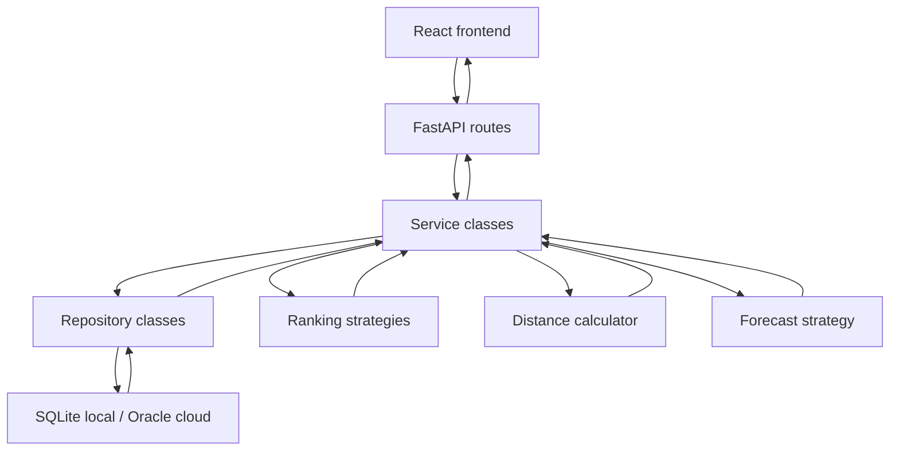
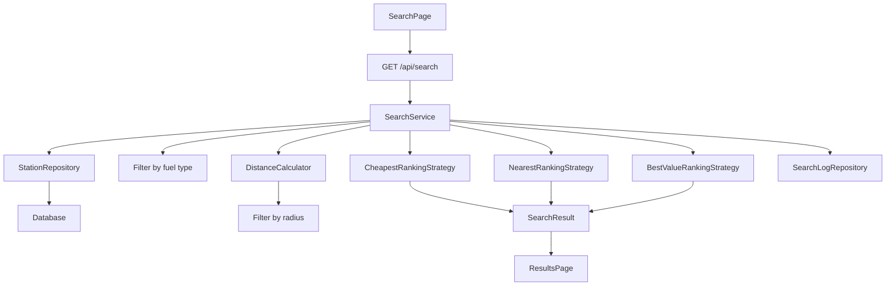
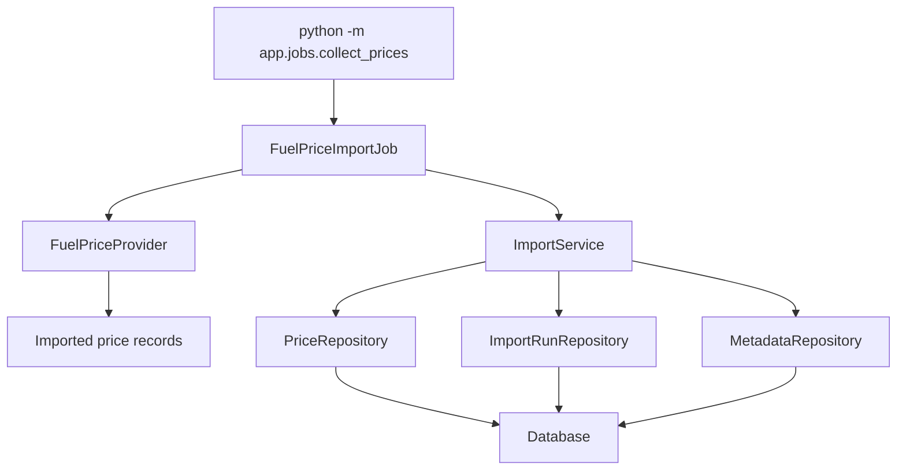

# FuelFinder Backend Design

## Purpose
This document describes the planned backend architecture for FuelFinder.

FuelFinder is designed as a small production-style full-stack application, not
as a simple coursework prototype.

The backend will be built with:
- Python;
- FastAPI;
- Pydantic;
- SQLAlchemy;
- Alembic later for migrations;
- SQLite for local/demo mode;
- Oracle Autonomous Database later for cloud production mode;
- object-oriented service, repository, algorithm, provider, and job layers.

## Core Direction

The current frontend already has the main user interface:
- SearchPage;
- ResultsPage;
- MapPage;
- AnalyticsPage;
- StationsPage.

The current frontend still uses local mock station data.
The backend must become the main source of truth.

Target data flow:

```text
React frontend
  -> HTTP API
  -> FastAPI routes
  -> service layer
  -> repositories
  -> database
```

Frontend mock data can remain only as fallback or development sample data.
It should not remain the main source of data in the final version.

## Production-Style Decisions

### SQLite Decision
SQLite is used as an embedded production-ready database for the first standalone
version.

It is not treated as a throwaway coursework shortcut.

The database layer is isolated behind repository classes, so the project can
later migrate to Oracle Autonomous Database or PostgreSQL without changing
service and algorithm logic.

### Oracle Cloud Direction
Target cloud architecture:

```text
Oracle Cloud Infrastructure

Oracle Compute VM
  -> Docker container: Nginx + React build
  -> Docker container: FastAPI backend

Oracle Autonomous Database
  -> FuelFinder production database
```

Later cloud-native version:

```text
OCI Object Storage + API Gateway
  -> React static frontend

Oracle Compute VM
  -> FastAPI backend

Oracle Autonomous Database
  -> FuelFinder database
```

### Architecture Rules

```text
Routes do not contain business logic.
Services do not contain raw SQL.
Repositories hide database access.
Algorithms are isolated and testable.
Providers and jobs handle fuel price import.
Configuration comes from environment variables.
No secrets are hardcoded.
```

## Planned Folder Structure

```text
backend/
  app/
    main.py
    config.py
    database.py

    routes/
      health_routes.py
      status_routes.py
      station_routes.py
      search_routes.py
      analytics_routes.py

    schemas/
      status_schema.py
      station_schema.py
      search_schema.py
      analytics_schema.py
      import_schema.py

    models/
      station_model.py
      fuel_type_model.py
      station_fuel_type_model.py
      price_record_model.py
      price_source_model.py
      price_import_run_model.py
      search_log_model.py
      app_metadata_model.py

    repositories/
      station_repository.py
      fuel_type_repository.py
      price_repository.py
      search_log_repository.py
      metadata_repository.py
      import_run_repository.py

    services/
      station_service.py
      search_service.py
      analytics_service.py
      status_service.py
      import_service.py

    algorithms/
      ranking_strategy.py
      forecast_strategy.py
      distance_calculator.py

    providers/
      base_provider.py
      seed_provider.py
      manual_provider.py
      public_page_provider.py

    jobs/
      collect_prices.py

  data/
    fuelfinder.db

  tests/
    test_health.py
    test_status.py
    test_station_service.py
    test_search_service.py
    test_ranking_strategy.py
    test_distance_calculator.py
    test_forecast_strategy.py

  requirements.txt
  Dockerfile
  .env.example
```

## Layer Responsibilities

### Routes
Routes are the HTTP layer.

Responsibilities:
- receive API requests;
- validate request parameters through FastAPI and Pydantic;
- call service classes;
- return response schemas.

Routes must not contain ranking, database, import, or forecast logic.

### Schemas
Schemas are Pydantic API models.

Responsibilities:
- describe request and response shapes;
- keep frontend/backend contracts clear;
- convert backend objects into JSON-friendly responses.

### Models
Models represent database tables.

Responsibilities:
- describe database rows;
- define table relationships;
- support repository queries through SQLAlchemy.

### Repositories
Repositories are the database access layer.

Responsibilities:
- read and write database data;
- hide SQLAlchemy query details from services;
- return domain-ready or schema-ready objects.

### Services
Services are the business logic layer.

Responsibilities:
- coordinate repositories;
- call ranking, distance, forecast, and import logic;
- prepare data for routes;
- keep application behavior clear and testable.

### Algorithms
Algorithms contain reusable pure logic.

Responsibilities:
- calculate distances;
- rank stations;
- calculate best-value score;
- forecast fuel prices.

Algorithms must not depend on FastAPI or database sessions.

### Providers
Providers collect fuel price data from a source.

Initial providers:
- seed data provider;
- manual data provider.

Future provider:
- public page provider, implemented carefully and respectfully.

### Jobs
Jobs execute background or manual import tasks.

Initial job:

```text
python -m app.jobs.collect_prices
```

## Required API Endpoints

```text
GET /health
GET /api/status
GET /api/fuel-types
GET /api/stations
GET /api/stations/{station_id}
GET /api/search
GET /api/analytics/fuel-trends
GET /api/analytics/forecast
```

### GET /health
Checks whether the backend process is running.

Example response:

```json
{
  "status": "ok"
}
```

### GET /api/status
Returns application and database status.

Example response:

```json
{
  "backendStatus": "online",
  "databaseStatus": "connected",
  "version": "1.0.0",
  "lastPriceUpdate": "2026-05-28T18:00:00",
  "lastImportStatus": "success"
}
```

Used by:
- StatusPanel.

### GET /api/fuel-types
Returns active fuel types.

Used by:
- SearchPage fuel type select;
- StationsPage filters;
- future forms and filters.

### GET /api/stations
Returns all active stations with latest current prices.

Used by:
- StationsPage;
- MapPage.

### GET /api/stations/{station_id}
Returns details for one station.

Used by:
- station detail view later;
- map popup details later.

### GET /api/search
Searches stations by:
- location text;
- optional latitude and longitude;
- radius in kilometers;
- fuel type.

The backend performs:
- fuel type filtering;
- radius filtering;
- distance calculation;
- cheapest ranking;
- nearest ranking;
- best-value ranking;
- search log creation.

### GET /api/analytics/fuel-trends
Returns recent fuel price history.

Used by:
- AnalyticsPage history card.

### GET /api/analytics/forecast
Returns forecast data for the next N days.

Used by:
- AnalyticsPage forecast card.

## Database Design

Local/demo mode:

```text
SQLite
```

Cloud production mode:

```text
Oracle Autonomous Database
```

The first implementation should use SQLAlchemy models that can work with SQLite
locally and be adapted to Oracle later through configuration and migrations.

## Planned Database Tables

```text
stations
fuel_types
station_fuel_types
price_records
price_sources
price_import_runs
search_logs
app_metadata
```

### stations

```text
id
name
brand
address
city
latitude
longitude
is_active
created_at
updated_at
```

### fuel_types

```text
id
code
label
is_active
```

Notes:
- `code` should be unique;
- example codes: diesel, petrol95, petrol98, lpg, diesel_plus, electric.

### station_fuel_types

```text
id
station_id
fuel_type_id
is_available
```

Notes:
- connects stations with available fuel types;
- should be unique by `station_id` and `fuel_type_id`.

### price_records

```text
id
station_id
fuel_type_id
price
currency
source
recorded_at
is_current
```

Notes:
- `price` should be positive;
- for each station and fuel type, only one record should be current;
- old records are kept for analytics and forecast.

### price_sources

```text
id
code
name
source_type
is_active
created_at
updated_at
```

Example source types:
- seed;
- manual;
- public_page;
- external_api later.

### price_import_runs

```text
id
source_id
status
records_found
records_inserted
error_message
started_at
finished_at
```

Used to track import history and last import status.

### search_logs

```text
id
location_text
latitude
longitude
radius_km
fuel_type_id
result_count
created_at
```

Used for:
- debugging;
- analytics;
- proving that search runs through the backend.

### app_metadata

```text
key
value
updated_at
```

Used for:
- backend version;
- seed version;
- last price update;
- last successful import;
- database status metadata.

## Main Domain/Data Classes

```text
Station
FuelType
StationFuelType
PriceRecord
SearchRequest
SearchResult
StationPriceView
FuelTrendPoint
ForecastPoint
ImportRunResult
```

## Class Responsibilities

### Station
Represents one fuel station.

Fields:
- id;
- name;
- brand;
- address;
- city;
- latitude;
- longitude;
- is active;
- created at;
- updated at.

### FuelType
Represents one fuel type.

Fields:
- id;
- code;
- label;
- is active.

### StationFuelType
Represents which fuel types are available at each station.

Fields:
- id;
- station id;
- fuel type id;
- is available.

### PriceRecord
Represents one station price for one fuel type at one time.

Fields:
- id;
- station id;
- fuel type id;
- price;
- currency;
- source;
- recorded at;
- is current.

### SearchRequest
Represents user search input.

Fields:
- location;
- radius km;
- fuel type;
- optional latitude;
- optional longitude.

### SearchResult
Represents backend search output.

Fields:
- matching stations;
- cheapest;
- nearest;
- best value.

### StationPriceView
Represents station data joined with latest price data.

Fields:
- station id;
- name;
- brand;
- address;
- city;
- latitude;
- longitude;
- fuel type;
- price;
- currency;
- distance km;
- recorded at.

### FuelTrendPoint
Represents one history point for analytics.

Fields:
- fuel type;
- date;
- average price.

### ForecastPoint
Represents one forecast point.

Fields:
- fuel type;
- date;
- predicted price.

### ImportRunResult
Represents one import execution result.

Fields:
- run id;
- source;
- status;
- records found;
- records inserted;
- error message.

## Repository Classes

Repositories only handle database access.

```text
StationRepository
FuelTypeRepository
PriceRepository
SearchLogRepository
MetadataRepository
ImportRunRepository
```

### StationRepository

```text
get_all_active_stations()
get_station_by_id(station_id)
get_stations_with_latest_prices()
get_stations_by_fuel_type(fuel_type_code)
```

### FuelTypeRepository

```text
get_all_active_fuel_types()
get_by_code(code)
```

### PriceRepository

```text
get_latest_prices()
get_latest_prices_by_fuel_type(fuel_type_code)
get_price_history(fuel_type_code, days)
insert_price_records(records)
mark_old_prices_as_not_current(station_id, fuel_type_id)
```

### SearchLogRepository

```text
create_search_log(request, result_count)
```

### MetadataRepository

```text
get_value(key)
set_value(key, value)
get_application_status()
```

### ImportRunRepository

```text
start_run(source_id)
finish_success(run_id, records_found, records_inserted)
finish_failed(run_id, error_message)
```

## Service Classes

Services coordinate repositories and algorithms.

```text
StationService
SearchService
AnalyticsService
StatusService
ImportService
```

### StationService

```text
list_stations()
get_station_details(station_id)
list_fuel_types()
```

### SearchService

```text
search(request)
filter_by_fuel_type(stations, fuel_type)
filter_by_radius(stations, request)
calculate_distances(stations, request)
```

Uses:
- StationRepository;
- SearchLogRepository;
- CheapestRankingStrategy;
- NearestRankingStrategy;
- BestValueRankingStrategy;
- DistanceCalculator.

### AnalyticsService

```text
get_fuel_trends(fuel_type, days)
get_forecast(fuel_type, days_ahead)
```

Uses:
- PriceRepository;
- LinearTrendForecastStrategy.

### StatusService

```text
get_status()
```

Returns:
- backend status;
- database status;
- last price update;
- last import status;
- version.

### ImportService

```text
run_import(provider_code)
save_imported_prices(records)
update_current_prices(records)
update_metadata()
```

## Algorithm Classes

Algorithms must be separate from FastAPI and database access.

```text
RankingStrategy
CheapestRankingStrategy
NearestRankingStrategy
BestValueRankingStrategy
ForecastStrategy
LinearTrendForecastStrategy
DistanceCalculator
```

### RankingStrategy

```text
rank(stations)
```

### CheapestRankingStrategy
Ranks stations by selected fuel price from lowest to highest.

### NearestRankingStrategy
Ranks stations by calculated distance from user coordinates.

### BestValueRankingStrategy
Ranks stations by combined price and distance score.

```text
score = price + distance_km * 0.01
```

### ForecastStrategy

```text
forecast(price_records, days_ahead)
```

### LinearTrendForecastStrategy
Calculates simple forecast from recent price history.

Steps:
1. group records by fuel type;
2. sort records by recorded_at;
3. calculate average daily change;
4. forecast next N days from latest price.

### DistanceCalculator

```text
calculate_distance_km(lat1, lon1, lat2, lon2)
```

Uses the Haversine formula.

## Provider And Job Classes

```text
FuelPriceProvider
SeedPriceProvider
ManualPriceProvider
PublicPagePriceProvider
FuelPriceImportJob
```

### FuelPriceProvider

```text
collect_prices()
```

Base provider interface.

### SeedPriceProvider
Returns realistic local seed data.

Used when real external data is unavailable.

### ManualPriceProvider
Supports manually prepared price records.

### PublicPagePriceProvider
Optional future provider for public fuel price pages.

It must be implemented carefully and respectfully.

### FuelPriceImportJob
Runs provider import.

Responsibilities:
- run provider;
- validate imported records;
- save price records;
- log import result;
- update metadata.

Command idea:

```text
python -m app.jobs.collect_prices
```

## Backend Class Diagram

```mermaid
classDiagram
  class Station {
    +int id
    +str name
    +str brand
    +str address
    +str city
    +float latitude
    +float longitude
    +bool is_active
    +datetime created_at
    +datetime updated_at
  }

  class FuelType {
    +int id
    +str code
    +str label
    +bool is_active
  }

  class StationFuelType {
    +int id
    +int station_id
    +int fuel_type_id
    +bool is_available
  }

  class PriceRecord {
    +int id
    +int station_id
    +int fuel_type_id
    +float price
    +str currency
    +str source
    +datetime recorded_at
    +bool is_current
  }

  class SearchRequest {
    +str location
    +float radius_km
    +str fuel_type
    +float? latitude
    +float? longitude
  }

  class StationPriceView {
    +int station_id
    +str name
    +str brand
    +str address
    +str city
    +float latitude
    +float longitude
    +str fuel_type
    +float price
    +str currency
    +float distance_km
    +datetime recorded_at
  }

  class SearchResult {
    +StationPriceView[] matching_stations
    +StationPriceView[] cheapest
    +StationPriceView[] nearest
    +StationPriceView[] best_value
  }

  class FuelTrendPoint {
    +str fuel_type
    +date date
    +float average_price
  }

  class ForecastPoint {
    +str fuel_type
    +date date
    +float predicted_price
  }

  class ImportRunResult {
    +int run_id
    +str source
    +str status
    +int records_found
    +int records_inserted
    +str error_message
  }

  class StationRepository {
    +get_all_active_stations() Station[]
    +get_station_by_id(station_id) Station
    +get_stations_with_latest_prices() StationPriceView[]
    +get_stations_by_fuel_type(fuel_type_code) StationPriceView[]
  }

  class FuelTypeRepository {
    +get_all_active_fuel_types() FuelType[]
    +get_by_code(code) FuelType
  }

  class PriceRepository {
    +get_latest_prices() PriceRecord[]
    +get_latest_prices_by_fuel_type(fuel_type_code) PriceRecord[]
    +get_price_history(fuel_type_code, days) PriceRecord[]
    +insert_price_records(records) int
    +mark_old_prices_as_not_current(station_id, fuel_type_id) None
  }

  class SearchLogRepository {
    +create_search_log(request, result_count) None
  }

  class MetadataRepository {
    +get_value(key) str
    +set_value(key, value) None
    +get_application_status() dict
  }

  class ImportRunRepository {
    +start_run(source_id) int
    +finish_success(run_id, records_found, records_inserted) None
    +finish_failed(run_id, error_message) None
  }

  class StationService {
    -StationRepository station_repository
    -FuelTypeRepository fuel_type_repository
    +list_stations() StationPriceView[]
    +get_station_details(station_id) StationPriceView
    +list_fuel_types() FuelType[]
  }

  class SearchService {
    -StationRepository station_repository
    -SearchLogRepository search_log_repository
    -DistanceCalculator distance_calculator
    -RankingStrategy cheapest_strategy
    -RankingStrategy nearest_strategy
    -RankingStrategy best_value_strategy
    +search(request) SearchResult
    +filter_by_fuel_type(stations, fuel_type) StationPriceView[]
    +filter_by_radius(stations, request) StationPriceView[]
    +calculate_distances(stations, request) StationPriceView[]
  }

  class AnalyticsService {
    -PriceRepository price_repository
    -ForecastStrategy forecast_strategy
    +get_fuel_trends(fuel_type, days) FuelTrendPoint[]
    +get_forecast(fuel_type, days_ahead) ForecastPoint[]
  }

  class StatusService {
    -MetadataRepository metadata_repository
    +get_status() dict
  }

  class ImportService {
    -PriceRepository price_repository
    -ImportRunRepository import_run_repository
    -MetadataRepository metadata_repository
    +run_import(provider_code) ImportRunResult
    +save_imported_prices(records) int
    +update_current_prices(records) None
    +update_metadata() None
  }

  class RankingStrategy {
    <<interface>>
    +rank(stations) StationPriceView[]
  }

  class CheapestRankingStrategy {
    +rank(stations) StationPriceView[]
  }

  class NearestRankingStrategy {
    +rank(stations) StationPriceView[]
  }

  class BestValueRankingStrategy {
    +rank(stations) StationPriceView[]
    -calculate_score(station) float
  }

  class ForecastStrategy {
    <<interface>>
    +forecast(price_records, days_ahead) ForecastPoint[]
  }

  class LinearTrendForecastStrategy {
    +forecast(price_records, days_ahead) ForecastPoint[]
    -calculate_average_daily_change(records) float
  }

  class DistanceCalculator {
    +calculate_distance_km(lat1, lon1, lat2, lon2) float
  }

  class FuelPriceProvider {
    <<interface>>
    +collect_prices() PriceRecord[]
  }

  class SeedPriceProvider {
    +collect_prices() PriceRecord[]
  }

  class ManualPriceProvider {
    +collect_prices() PriceRecord[]
  }

  class PublicPagePriceProvider {
    +collect_prices() PriceRecord[]
  }

  class FuelPriceImportJob {
    -ImportService import_service
    -FuelPriceProvider provider
    +run() ImportRunResult
  }

  Station "1" --> "*" StationFuelType
  FuelType "1" --> "*" StationFuelType
  Station "1" --> "*" PriceRecord
  FuelType "1" --> "*" PriceRecord

  StationRepository --> Station
  StationRepository --> StationPriceView
  FuelTypeRepository --> FuelType
  PriceRepository --> PriceRecord

  StationService --> StationRepository
  StationService --> FuelTypeRepository
  SearchService --> StationRepository
  SearchService --> SearchLogRepository
  SearchService --> DistanceCalculator
  SearchService --> RankingStrategy
  AnalyticsService --> PriceRepository
  AnalyticsService --> ForecastStrategy
  StatusService --> MetadataRepository
  ImportService --> PriceRepository
  ImportService --> ImportRunRepository
  ImportService --> MetadataRepository

  RankingStrategy <|.. CheapestRankingStrategy
  RankingStrategy <|.. NearestRankingStrategy
  RankingStrategy <|.. BestValueRankingStrategy
  ForecastStrategy <|.. LinearTrendForecastStrategy
  FuelPriceProvider <|.. SeedPriceProvider
  FuelPriceProvider <|.. ManualPriceProvider
  FuelPriceProvider <|.. PublicPagePriceProvider
  FuelPriceImportJob --> FuelPriceProvider
  FuelPriceImportJob --> ImportService

  SearchRequest --> SearchResult
  SearchResult --> StationPriceView
```



## Request Flow Diagram



## Search Flow



## Import Flow



## Development Order

Planned backend implementation order:

1. Create FastAPI backend skeleton.
2. Add `/health` and `/api/status`.
3. Add SQLAlchemy models and local SQLite configuration.
4. Add Alembic migrations.
5. Add seed data.
6. Implement `/api/fuel-types` and `/api/stations`.
7. Implement `/api/stations/{station_id}`.
8. Implement `/api/search` with backend filtering, distance calculation, and ranking strategies.
9. Implement analytics and forecast endpoints.
10. Add import provider structure and seed/manual import job.
11. Add tests for algorithms and main endpoints.
12. Add Dockerfile and docker-compose for local run.
13. Connect frontend to backend API.
14. Prepare Oracle database configuration later.

## Testing Plan

Unit tests should focus on pure logic first:
- distance calculator;
- ranking strategies;
- search filtering;
- forecast calculation;
- services with fake repositories.

API tests should verify:
- `/health` returns status ok;
- `/api/status` returns expected response shape;
- `/api/fuel-types` returns active fuel types;
- `/api/stations` returns station list;
- `/api/search` returns ranked results;
- analytics endpoints return valid response shapes.

## Docker Plan

Docker should be added after the backend works locally.

Planned files:

```text
backend/Dockerfile
docker-compose.yml
.env.example
```

Initial Docker goal:
- run FastAPI backend in a container;
- serve React build through Nginx;
- store SQLite database in a mounted `data/` folder for local/demo mode;
- keep configuration in environment variables.

This keeps the project deployable to:
- local development machine;
- second computer used as a small server;
- Oracle Cloud VM.
