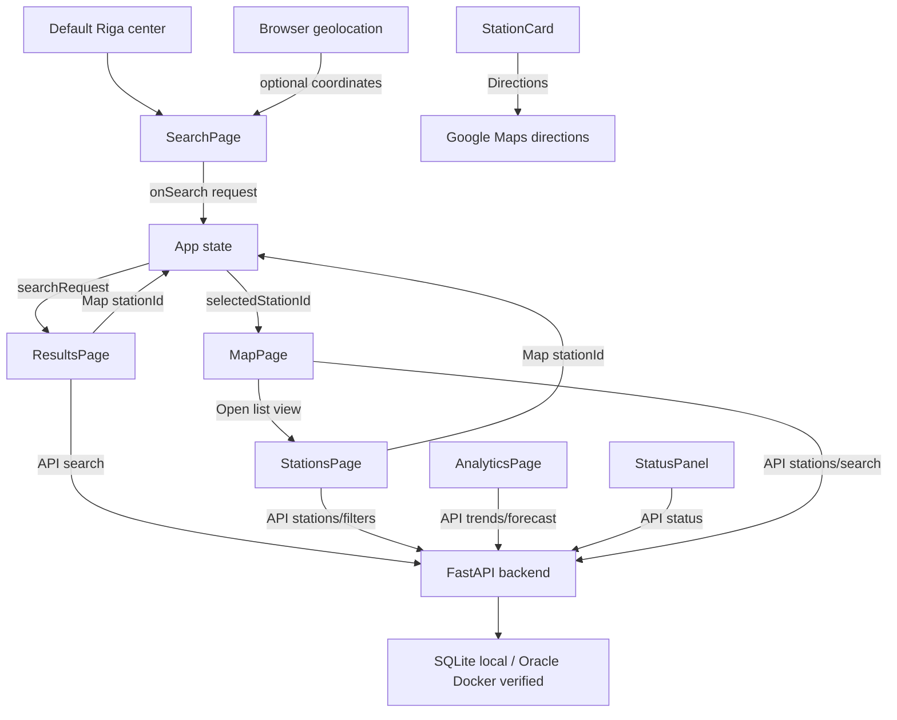
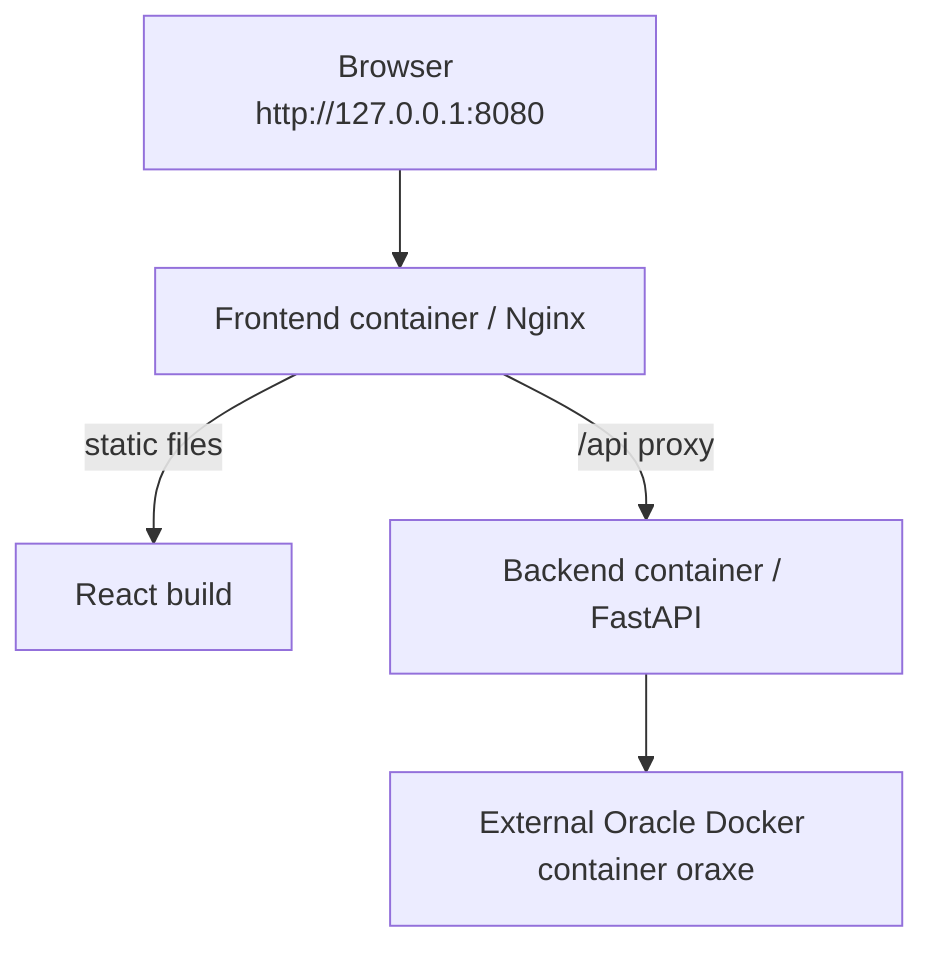

# FuelFinder Page Flow

## Purpose

This document describes the current runtime flow between the five frontend
pages, the FastAPI backend, and the database.

The application does not use frontend mock station data as the runtime source
of truth. Pages load data through `frontend/src/api/fuelFinderApi.ts`.

The same page flow has been verified with:
- SQLite local/demo database;
- Oracle Database running in Docker;
- backend Docker container;
- frontend Nginx container with `/api` reverse proxy;
- Docker Compose frontend + backend stack with external Oracle.

## Runtime Data Flow

Development:

```text
React page
  -> fuelFinderApi.ts
  -> FastAPI backend
  -> database
```

Container/production-like:

```text
Browser
  -> Nginx frontend container
  -> /api reverse proxy
  -> FastAPI backend container
  -> database
```

Current database targets:

```text
SQLite local/demo
Oracle Database in Docker
```

## Main User Flow

```text
SearchPage
  -> default search center is Riga, Latvia
  -> user chooses radius and fuel type
  -> user can request browser current location
  -> user clicks Find stations
  -> App stores SearchRequest
  -> App opens ResultsPage

ResultsPage
  -> loads backend search results using coordinates
  -> user chooses comparison mode:
       Cheapest
       Nearest
       Best value
  -> page shows top 3 matching stations
  -> Map opens MapPage with selected station highlighted
  -> Directions opens Google Maps route in a new tab

MapPage
  -> loads backend stations or backend search results
  -> shows Leaflet/OpenStreetMap map
  -> highlights selected station in red
  -> Open list view opens StationsPage

StationsPage
  -> loads backend stations
  -> loads backend filter values
  -> user can filter by text, fuel type, and brand
  -> shows recorded update dates for current prices
  -> Map opens MapPage with selected station highlighted

AnalyticsPage
  -> loads backend fuel history
  -> loads backend forecast
  -> frontend filters history by range and fuel type
  -> renders history and forecast charts

StatusPanel
  -> loads /api/status
  -> shows version, database connection, and latest price update
```

## App State

`App.tsx` stores:

```ts
activePage: PageName
selectedStationId: number | null
searchRequest: SearchRequest | null
```

State responsibilities:
- `activePage` controls which page is visible;
- `selectedStationId` controls which map marker is highlighted;
- `searchRequest` stores the latest search form values.

## Page 1: SearchPage

Purpose:
- collect search parameters without pretending to support address geocoding.

Current content:
- locked/read-only location field;
- default location: `Riga, Latvia`;
- default coordinates: Riga center;
- status text explaining default Riga center;
- radius select;
- fuel type select loaded from backend fuel types;
- `Find stations` button;
- `Use current location` button.

Current behavior:
- default search uses Riga center coordinates;
- `Use current location` uses browser geolocation;
- if permission is granted, latitude and longitude are updated;
- if permission is denied/unavailable, the page falls back to Riga center;
- `Find stations` sends the request to `App`;
- `App` stores the request and opens `ResultsPage`.

Current limitation:
- manual location text and street/city geocoding are intentionally not
  implemented in V1.

## Page 2: ResultsPage

Purpose:
- compare matching station options.

Current behavior:
- calls `/api/search` using the stored coordinates, radius, and fuel type;
- sorts loaded stations by cheapest, nearest, or best value;
- shows top 3 station cards;
- station cards show formatted current price update dates;
- `Map` selects a station and opens MapPage;
- `Directions` opens Google Maps route using station coordinates.

Current best-value score:

```text
price + distanceKm * 0.01
```

## Page 3: MapPage

Purpose:
- show station locations visually.

Current behavior:
- loads backend station data;
- when a search request with coordinates exists, loads `/api/search`;
- otherwise loads `/api/stations`;
- renders Leaflet/OpenStreetMap markers;
- highlights selected station or top search results;
- loading status is shown in the map header to avoid layout jumps;
- map popups show fuel, price, distance when available, and update date;
- opens StationsPage through `Open list view`.

## Page 4: AnalyticsPage

Purpose:
- show fuel price history and forecast.

Current behavior:
- loads `/api/analytics/fuel-trends`;
- loads `/api/analytics/forecast`;
- frontend filters history locally by:
  - `1W`;
  - `1M`;
  - `3M`;
  - `6M`;
  - `1Y`;
- frontend filters by fuel type:
  - Diesel;
  - Diesel+;
  - LPG;
  - Petrol 95;
  - Petrol 98;
  - EV;
- default history state is `1W + All`;
- selected fuel view shows min/avg/max/current summary;
- EV has a stable no-history/empty state;
- reset returns to `1W + All`;
- forecast warning says:

```text
Algorithmic forecast for demo purposes only. May vary from actual market prices.
```

Forecast ownership:
- backend calculates forecast data;
- frontend only renders the returned forecast points.

## Page 5: StationsPage

Purpose:
- show all known fuel stations.

Current behavior:
- loads stations from `/api/stations`;
- loads brands from `/api/stations/filters`;
- filters by backend fuel type and brand parameters;
- applies local text filter to the loaded list;
- shows formatted current price update dates;
- `Map` selects station and opens MapPage.

## Status Panel

Purpose:
- show application and database health.

Current behavior:
- calls `/api/status`;
- shows backend version;
- shows green database indicator when backend is online and DB is connected;
- shows latest price update timestamp from backend `lastPriceUpdate`;
- does not show `lastImportStatus` in the public UI.

## Implemented API Endpoints

```text
GET /health
GET /api/status
GET /api/fuel-types
GET /api/stations
GET /api/stations/{station_id}
GET /api/stations/filters
GET /api/search
GET /api/analytics/fuel-trends
GET /api/analytics/forecast
```

## Interaction Diagram



## Container Flow Diagram



## Verified Flow

The current flow has been smoke-tested as:

```text
Browser
  -> frontend Nginx container
  -> backend FastAPI container
  -> Oracle Database running in Docker
```

The same frontend/backend API contracts work with either SQLite or Oracle as
long as `DATABASE_URL` points to the desired database.
