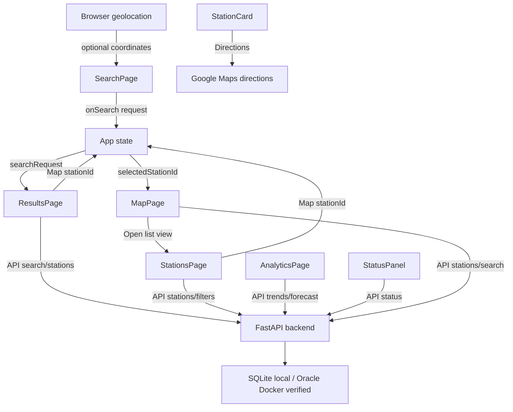

# FuelFinder Page Flow

## Purpose

This document describes the current runtime flow between the five frontend pages,
the FastAPI backend, and the database.

The application no longer uses frontend mock station data as the runtime source
of truth. Pages load data through `frontend/src/api/fuelFinderApi.ts`.

The same page flow has been verified with both the SQLite local/demo database
and Oracle Database running in Docker. The frontend/backend API contracts did
not need to change for the Oracle-backed run.

## Main User Flow

```text
SearchPage
  -> user enters location, radius, and fuel type
  -> user can request browser current location
  -> user clicks Find stations
  -> App stores SearchRequest
  -> App opens ResultsPage

ResultsPage
  -> loads backend search results when coordinates are available
  -> otherwise loads backend stations filtered by fuel type
  -> user chooses comparison mode:
       Cheapest
       Nearest
       Best value
  -> page shows top 3 matching stations
  -> Map opens MapPage with selected station highlighted
  -> Directions opens Google Maps route in a new tab

MapPage
  -> loads backend stations or backend search results
  -> shows Leaflet/OpenStreetMap map
  -> highlights selected station in red
  -> Open list view opens StationsPage

StationsPage
  -> loads backend stations
  -> loads backend filter values
  -> user can filter by text, fuel type, and brand
  -> Map opens MapPage with selected station highlighted

AnalyticsPage
  -> loads backend fuel history
  -> loads backend forecast
  -> renders history and forecast charts

StatusPanel
  -> loads /api/status
  -> shows version, database connection, and latest price update
```

## App State

`App.tsx` stores:

```ts
activePage: PageName
selectedStationId: number | null
searchRequest: SearchRequest | null
```

State responsibilities:
- `activePage` controls which page is visible;
- `selectedStationId` controls which map marker is highlighted;
- `searchRequest` stores the latest search form values.

## Runtime Data Flow

```text
React page
  -> fuelFinderApi.ts
  -> FastAPI endpoint
  -> service layer
  -> repository layer
  -> database
  -> response rendered by React page
```

Supported local/demo database:

```text
SQLite
```

Verified local Oracle database:

```text
Oracle Database in Docker
```

## Page 1: SearchPage

Purpose:
- collect user search input.

Current content:
- page title: `Find nearby fuel stations`;
- location input;
- radius select;
- fuel type select loaded from backend fuel types;
- `Find stations` button;
- `Use current location` button.

Current behavior:
- form values are controlled with React state;
- `Use current location` uses browser geolocation;
- if permission is granted, latitude and longitude are stored in `SearchRequest`;
- `Find stations` sends the request to `App`;
- `App` stores the request and opens `ResultsPage`.

Current limitation:
- manual location text is not geocoded;
- radius filtering is only real when coordinates are available.

## Page 2: ResultsPage

Purpose:
- compare matching station options.

Current behavior:
- if coordinates are available, calls `/api/search`;
- if coordinates are not available, calls `/api/stations` filtered by fuel type;
- sorts loaded stations by cheapest, nearest, or best value;
- shows top 3 station cards;
- `Map` selects a station and opens MapPage;
- `Directions` opens Google Maps route using station coordinates.

Current best-value score:

```text
price + distanceKm * 0.01
```

## Page 3: MapPage

Purpose:
- show station locations visually.

Current behavior:
- loads backend station data;
- when a search request with coordinates exists, loads `/api/search`;
- otherwise loads `/api/stations`;
- renders Leaflet/OpenStreetMap markers;
- highlights selected station;
- opens StationsPage through `Open list view`.

## Page 4: AnalyticsPage

Purpose:
- show fuel price history and forecast.

Current behavior:
- loads `/api/analytics/fuel-trends`;
- loads `/api/analytics/forecast`;
- renders SVG history and forecast charts;
- shows fuel summary data derived from backend trend points.

Forecast ownership:
- backend calculates forecast data;
- frontend only renders the returned forecast points.

## Page 5: StationsPage

Purpose:
- show all known fuel stations.

Current behavior:
- loads stations from `/api/stations`;
- loads cities and brands from `/api/stations/filters`;
- filters by backend fuel type and brand parameters;
- applies local text filter to the loaded list;
- `Map` selects station and opens MapPage.

## Status Panel

Purpose:
- show application and database health.

Current behavior:
- calls `/api/status`;
- shows backend version;
- shows green database indicator when backend is online and DB is connected;
- shows latest price update timestamp from backend `lastPriceUpdate`;
- does not show `lastImportStatus` in the public UI.

## Implemented API Endpoints

```text
GET /health
GET /api/status
GET /api/fuel-types
GET /api/stations
GET /api/stations/{station_id}
GET /api/stations/filters
GET /api/search
GET /api/analytics/fuel-trends
GET /api/analytics/forecast
```

## Interaction Diagram



## Verified Flow

The current flow has been smoke-tested as:

```text
React frontend
  -> FastAPI backend
  -> Oracle Database running in Docker
```

The same frontend/backend API contracts should work with either SQLite or Oracle
as long as `DATABASE_URL` points to the desired database.

Next flow work is packaging/deployment oriented: containerize backend/frontend
or prepare the same API flow for Oracle Autonomous Database.
