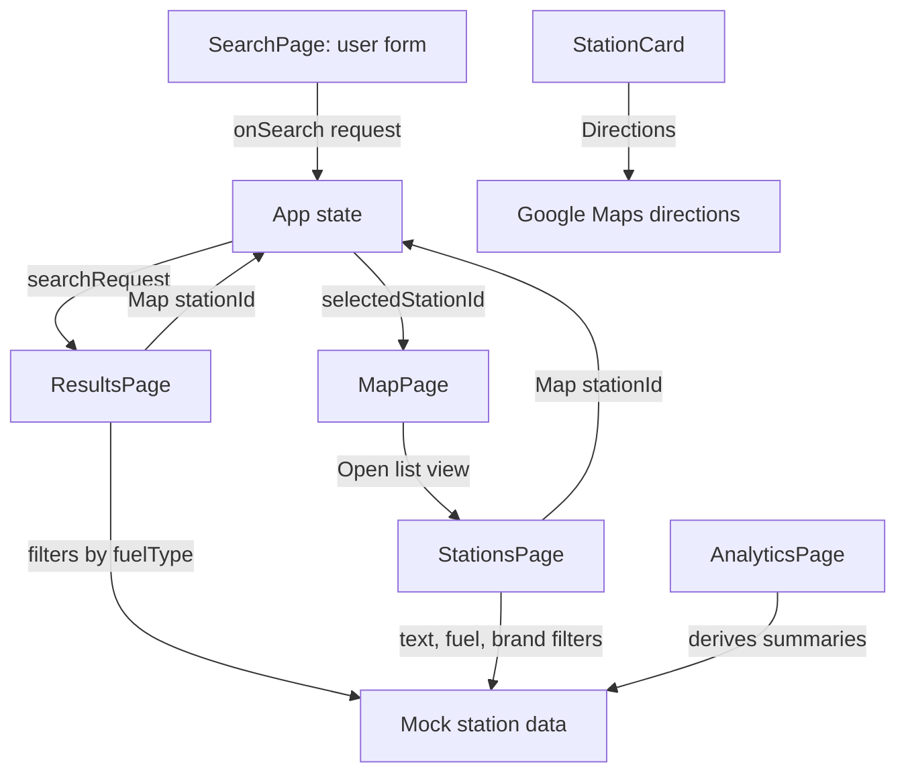

# FuelFinder Page Flow

## Purpose
This document describes how the five main frontend pages work together.

Current stage:
- frontend only;
- mock data only;
- no backend connection yet;
- database indicator is a visual placeholder;
- GitHub history is used for incremental checkpoints.

Future stage:
- SearchPage will call backend API;
- backend will read SQLite data;
- ResultsPage, MapPage, AnalyticsPage, and StationsPage will use API data.

## Main User Flow

```text
SearchPage
  -> user enters location, radius, and fuel type
  -> user clicks Find stations
  -> App stores SearchRequest
  -> App opens ResultsPage

ResultsPage
  -> filters mock stations by selected fuel type
  -> user chooses comparison mode:
       Cheapest
       Nearest
       Best value
  -> page shows top 3 matching stations
  -> Map opens MapPage with selected station highlighted
  -> Directions opens Google Maps route in a new tab

MapPage
  -> shows Leaflet/OpenStreetMap map
  -> highlights selected station in red
  -> Open list view opens StationsPage

StationsPage
  -> shows all mock stations in a table
  -> user can filter by text, fuel type, and brand
  -> Map opens MapPage with selected station highlighted

AnalyticsPage
  -> shows fuel trend preview
  -> shows forecast preview
  -> shows fuel update dates from mock station data
```

## Current App State

`App.tsx` currently stores:

```ts
activePage: PageName
selectedStationId: number | null
searchRequest: SearchRequest | null
```

State responsibilities:
- `activePage` controls which page is visible;
- `selectedStationId` controls which map marker is highlighted;
- `searchRequest` stores the latest search form values.

## Current Frontend Data Flow

```text
src/data/stations.ts
  -> SearchPage creates SearchRequest
  -> App stores SearchRequest
  -> ResultsPage filters stations by fuelType
  -> ResultsPage sorts top stations by active comparison mode
  -> MapPage highlights selected station
  -> StationsPage displays and filters all stations
  -> AnalyticsPage derives fuel update summaries
```

## Future Backend Data Flow

```text
SearchPage form
  -> /api/search request
  -> FastAPI backend
  -> SQLite database
  -> /api/search response
  -> ResultsPage / MapPage

StationsPage
  -> /api/stations request
  -> FastAPI backend
  -> SQLite database
  -> station table

AnalyticsPage
  -> /api/analytics request
  -> FastAPI backend
  -> price_records table
  -> trend and forecast response
```

## Page 1: SearchPage

Purpose:
- collect user search input.

Current content:
- page title: `Find nearby fuel stations`;
- location input;
- radius select;
- fuel type select;
- `Find stations` button;
- `Use current location` placeholder button.

Current behavior:
- form values are controlled with React state;
- `Find stations` sends a `SearchRequest` to `App`;
- `App` stores the request and opens `ResultsPage`;
- `Use current location` currently shows a placeholder alert.

Future behavior:
- validate user input;
- use browser geolocation API;
- convert current coordinates to a search location;
- send search request to backend;
- show errors if backend request fails.

## Page 2: ResultsPage

Purpose:
- compare matching station options.

Current content:
- page title: `Compare station results`;
- search summary chips;
- comparison mode buttons:
  - Cheapest;
  - Nearest;
  - Best value;
- top 3 station cards for the active comparison mode.

Current behavior:
- filters mock stations by `searchRequest.fuelType`;
- sorts filtered stations by active mode;
- shows empty message if no mock stations match selected fuel type;
- `Map` button selects station and opens MapPage;
- `Directions` button opens Google Maps route using station coordinates.

Current best-value score:

```text
price + distanceKm * 0.01
```

Future behavior:
- use backend response instead of local mock filtering;
- tune best-value score for real coursework explanation;
- include user location distance from backend calculation.

## Page 3: MapPage

Purpose:
- show station locations visually.

Current content:
- page title: `Station map`;
- number of stations shown in preview;
- Leaflet map;
- OpenStreetMap tile layer;
- station markers from mock coordinates;
- `Open list view` button;
- map/source note.

Current behavior:
- markers use mock station latitude and longitude;
- selected station marker is highlighted in red;
- if no station is selected, first preview stations are highlighted;
- `Open list view` opens StationsPage.

Future behavior:
- replace mock station coordinates with backend station data;
- highlight selected station from ResultsPage or StationsPage;
- keep OpenStreetMap attribution visible.

## Page 4: AnalyticsPage

Purpose:
- show fuel price trends and forecast concept.

Current content:
- page title: `Fuel price trends`;
- History card;
- Forecast card;
- mock chart lines;
- history dates;
- 3-day forecast dates;
- fuel type update list for history;
- forecast disclaimer.

Current behavior:
- derives fuel type summaries from mock station data;
- uses latest `lastUpdate` per fuel type;
- forecast is visual only and explicitly marked as an estimate.

Forecast algorithm decision for backend:

```text
3-day simple linear trend forecast
```

Planned backend algorithm:
1. read recent `PriceRecord` rows per fuel type;
2. sort records by date;
3. calculate average daily price change;
4. forecast next 3 days from latest price;
5. return forecast values to AnalyticsPage.

## Page 5: StationsPage

Purpose:
- show all known fuel stations.

Current content:
- page title: `All stations`;
- text search input;
- fuel type select;
- brand filter chips;
- station table;
- station name and brand;
- address;
- map action;
- price;
- last update.

Current behavior:
- shows all mock station rows;
- filters by name, city, or address text;
- filters by exact fuel type;
- filters by exact brand;
- combines active filters with AND logic;
- `Map` button selects station and opens MapPage.

Future behavior:
- fetch all stations from backend;
- add pagination or internal scroll if dataset grows.

## Shared Types

Implemented type files:

```text
src/types/page.ts
src/types/station.ts
src/types/search.ts
```

Implemented data file:

```text
src/data/stations.ts
```

## Station Type

```ts
export type FuelType =
  | 'diesel'
  | 'petrol95'
  | 'petrol98'
  | 'lpg'
  | 'diesel plus'
  | 'electric'

export type Station = {
  id: number
  name: string
  brand: string
  address: string
  city: string
  latitude: number
  longitude: number
  fuelType: FuelType
  price: number
  currency: 'EUR'
  distanceKm: number
  lastUpdate: string
}
```

## Search Types

```ts
import type { FuelType, Station } from './station'

export type SearchRequest = {
  location: string
  radiusKm: number
  fuelType: FuelType
}

export type SearchResult = {
  stations: Station[]
  cheapestStation: Station | null
  nearestStation: Station | null
  bestValueStation: Station | null
}
```

## Interaction Diagram



## Backend Replacement Plan

The current mock data flow should be replaceable without changing the main UI:

```text
Current:
stations.ts -> local filtering -> UI

Future:
FastAPI endpoints -> fetch calls -> UI
```

Planned endpoints:
- `GET /health`;
- `GET /api/stations`;
- `GET /api/search`;
- `GET /api/analytics/fuel-trends`;
- `GET /api/analytics/forecast`.

## Development Order

Completed:
1. Build visual shell.
2. Build SearchPage form.
3. Add station/search types.
4. Add mock station data.
5. Build ResultsPage with fuel filtering.
6. Build StationsPage table.
7. Build MapPage with Leaflet and station highlighting.
8. Build AnalyticsPage mock history and forecast.
9. Add map/directions interactions.
10. Add station table filters.

Next:
1. Responsive layout pass.
2. Coursework report notes.
3. Backend API scaffold.
4. SQLite schema and seed data.
5. Replace mock data with backend API calls.
