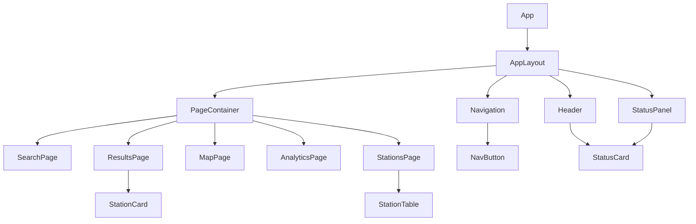
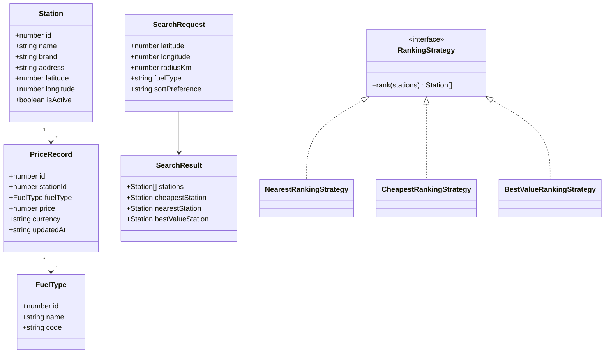

# FuelFinderNew Project Structure

## Purpose
FuelFinderNew is the simplified coursework version of Fuel Finder.

The first goal is to build a clear React frontend based on the UI concepts.
Backend, database, and real API integration will be added later.

## Frontend Component Structure

The React application will be split into layout components, pages, and shared UI components.

```text
App
  AppLayout
    Header
    Navigation
    StatusPanel
    PageContainer

Pages:
  SearchPage
  ResultsPage
  MapPage
  AnalyticsPage
  StationsPage

Shared:
  NavButton
  StationCard
  StationTable
  StatusCard
```

## Component Responsibilities

### App
Main application entry component.

Responsibilities:
- starts the React app structure;
- connects the main layout;
- later connects routing between pages.

### AppLayout
Shared page frame used by all screens.

Responsibilities:
- creates the main brown outer shell;
- places the header area;
- places the navigation;
- renders the current page inside the content area.

### Header
Top-left identity block.

Responsibilities:
- shows fuel icon;
- shows project title;
- shows short subtitle.

### Navigation
Main page navigation.

Responsibilities:
- shows buttons for all main pages;
- highlights the active page;
- later changes the current route.

### StatusPanel
Top-right project status area.

Responsibilities:
- shows version;
- shows database indicator;
- shows latest update timestamp.

### PageContainer
Inner cream content panel.

Responsibilities:
- wraps each page in the same visual style;
- keeps page spacing consistent.

## Page Responsibilities

### SearchPage
Main search form.

Fields:
- latitude;
- longitude;
- radius;
- fuel type;
- sort preference.

Main action:
- find stations.

### ResultsPage
Comparison results screen.

Shows:
- cheapest station;
- nearest station;
- best-value station;
- search values summary;
- simple price trend preview.

### MapPage
Station map screen.

Shows:
- map area;
- station markers;
- number of stations on map;
- link or button to list view.

### AnalyticsPage
Fuel price analytics screen.

Shows:
- historical fuel trends;
- simple forecast;
- fuel type comparison.

### StationsPage
All stations table.

Shows:
- station name;
- address;
- price;
- last update;
- map action.

## Shared Components

### NavButton
Reusable navigation button.

Props planned:
- label;
- icon;
- active;
- target route.

### StationCard
Reusable station summary card.

Used by:
- ResultsPage;
- MapPage popups or side panels.

### StationTable
Reusable table for station lists.

Used by:
- StationsPage;
- possible search result list.

### StatusCard
Reusable small information card.

Used by:
- Header/status area;
- search summary;
- result summaries.

## Domain Model

The domain model describes the application logic.
These classes are not necessarily React components.
They are useful for backend logic, TypeScript types, and coursework diagrams.

```text
Station
FuelType
PriceRecord
SearchRequest
SearchResult
RankingStrategy
NearestRankingStrategy
CheapestRankingStrategy
BestValueRankingStrategy
```

## Domain Class Responsibilities

### Station
Represents one fuel station.

Fields:
- id;
- name;
- brand;
- address;
- latitude;
- longitude;
- active status.

### FuelType
Represents one fuel type.

Examples:
- diesel;
- petrol 95;
- petrol 98;
- LPG.

### PriceRecord
Represents one fuel price entry for one station.

Fields:
- station id;
- fuel type;
- price;
- currency;
- updated time.

### SearchRequest
Represents user search input.

Fields:
- latitude;
- longitude;
- radius;
- fuel type;
- sort preference.

### SearchResult
Represents search output.

Contains:
- all matching stations;
- cheapest station;
- nearest station;
- best-value station.

### RankingStrategy
Interface or abstract base for sorting stations.

Purpose:
- allows different ranking algorithms to be used with the same search result data.

### NearestRankingStrategy
Ranks stations by distance.

### CheapestRankingStrategy
Ranks stations by fuel price.

### BestValueRankingStrategy
Ranks stations by combined price and distance.

## Component Diagram Draft



## Class Diagram Draft



## Development Order

1. Build App and AppLayout.
2. Build Header, StatusPanel, and Navigation.
3. Add placeholder pages.
4. Add mock station data.
5. Build SearchPage.
6. Build ResultsPage.
7. Build StationsPage.
8. Build MapPage.
9. Build AnalyticsPage.
10. Add backend and database later.
