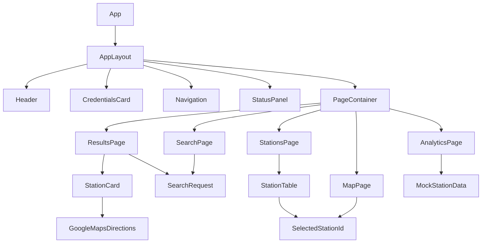
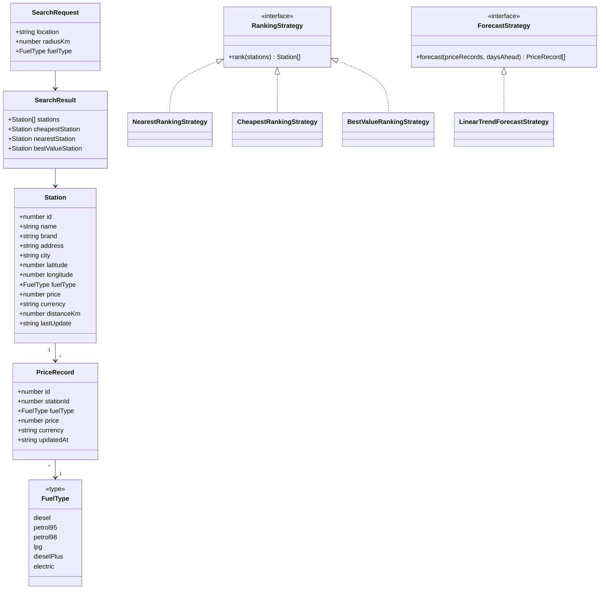

# FuelFinderNew Project Structure

## Purpose
FuelFinderNew is the simplified coursework version of Fuel Finder.

The current goal is to build a clear React frontend based on the UI concepts.
The project currently uses mock station data in the frontend. Backend, database,
and real API integration will be added later.

## Current Frontend Status

Implemented:
- React + Vite frontend;
- 5 main pages;
- shared visual shell based on the UI concepts;
- controlled search form;
- mock station dataset;
- fuel type filtering in results;
- top station comparison modes;
- station table with frontend filters;
- Leaflet/OpenStreetMap map with station selection;
- Directions buttons that open Google Maps;
- Lucide icons across header, navigation, and station actions;
- analytics history/forecast preview;
- database status placeholder.

Not implemented yet:
- backend API;
- real SQLite connection;
- real geocoding;
- real price history forecast calculation.

## Frontend Component Structure

```text
App
  AppLayout
    Header
    CredentialsCard
    Navigation
    StatusPanel
    PageContainer

Pages:
  SearchPage
  ResultsPage
  MapPage
  AnalyticsPage
  StationsPage

Shared:
  StationCard
  StationTable
  StatusCard
```

## Component Responsibilities

### App
Main application entry component.

Responsibilities:
- stores the active page;
- stores the current search request;
- stores the selected station id for map highlighting;
- connects page-level callbacks;
- renders the active page inside `AppLayout`.

Current state:

```ts
activePage: PageName
selectedStationId: number | null
searchRequest: SearchRequest | null
```

### AppLayout
Shared page frame used by all screens.

Responsibilities:
- creates the main brown outer shell;
- places the header row;
- places the navigation row;
- renders the current page inside the content panel.

### Header
Top-left identity block.

Responsibilities:
- shows the Fuel Finder title;
- shows the short subtitle.

### CredentialsCard
Coursework identity block.

Responsibilities:
- shows developer information;
- can be removed or redesigned later if not needed.

### Navigation
Main page navigation.

Responsibilities:
- shows buttons for all main pages;
- highlights the active page;
- calls `onPageChange` when the user changes page.

### StatusPanel
Top-right project status area.

Responsibilities:
- shows version;
- shows database indicator placeholder;
- shows latest update timestamp placeholder.

Current note:
- the red database indicator is not connected to a real database yet.

### PageContainer
Inner cream content panel.

Responsibilities:
- wraps each page in the same visual style;
- keeps page spacing consistent;
- scrolls internal page content when needed.

## Page Responsibilities

### SearchPage
Main search form.

Fields:
- location;
- radius;
- fuel type.

Main actions:
- `Find stations` sends a `SearchRequest` to `App`;
- `Use current location` is a placeholder for future browser geolocation logic.

Current behavior:
- controlled React state is used for form values;
- submitting the form opens `ResultsPage`.

### ResultsPage
Comparison results screen.

Shows:
- current search summary;
- comparison mode buttons:
  - Cheapest;
  - Nearest;
  - Best value;
- top 3 stations for the active comparison mode;
- station cards with `Map` and `Directions` actions.

Current behavior:
- filters mock stations by selected fuel type;
- sorts filtered stations by price, distance, or best-value score;
- `Map` opens MapPage and highlights the selected station;
- `Directions` opens Google Maps directions using station coordinates.

### MapPage
Station map screen.

Shows:
- Leaflet map with OpenStreetMap tiles;
- station markers;
- red highlight for selected station;
- first 3 preview stations highlighted when no station is selected;
- button to open the station list.

Current behavior:
- renders all mock stations by latitude and longitude;
- keeps OpenStreetMap attribution visible;
- uses normal browser tile caching only.

Future behavior:
- replace mock station data with backend station coordinates;
- consider a dedicated tile provider for public production use.

### AnalyticsPage
Fuel price analytics screen.

Shows:
- history chart preview;
- forecast chart preview;
- fuel type legend based on current mock station data;
- latest update dates from the mock dataset;
- forecast disclaimer.

Current forecast decision:
- the current chart is a visual mock;
- the planned real algorithm is a 3-day simple linear trend forecast based on recent price history.

### StationsPage
All stations table.

Shows:
- station name;
- brand;
- address;
- map action;
- price;
- last update.

Current behavior:
- uses mock station data;
- filters table by station text search;
- filters table by fuel type;
- filters table by brand chips;
- `Map` opens MapPage and highlights the selected station.

Current filter logic:
- text query checks station name, city, and address;
- fuel type select matches exact `FuelType`;
- brand chip matches exact station brand;
- all active filters are combined with AND logic.

## Shared Components

### StationCard
Reusable station summary card.

Used by:
- ResultsPage.

Props:
- station;
- optional rank;
- optional map selection callback.

Actions:
- `Map` selects a station and opens MapPage;
- `Directions` opens Google Maps directions in a new tab.

### StationTable
Reusable table for station lists.

Used by:
- StationsPage.

Props:
- station list;
- optional map selection callback.

### StatusCard
Planned reusable small information card.

Current note:
- status-like information is currently implemented directly in `StatusPanel`.

## Type Files

```text
src/types/page.ts
src/types/station.ts
src/types/search.ts
```

## Data Files

```text
src/data/stations.ts
```

The current data file contains mock station records for frontend development.

## Domain Model

The domain model describes the application logic.
These classes are not necessarily React components.
They are useful for backend logic, TypeScript types, and coursework diagrams.

```text
Station
FuelType
PriceRecord
SearchRequest
SearchResult
RankingStrategy
NearestRankingStrategy
CheapestRankingStrategy
BestValueRankingStrategy
ForecastStrategy
LinearTrendForecastStrategy
```

## Domain Class Responsibilities

### Station
Represents one fuel station.

Fields:
- id;
- name;
- brand;
- address;
- city;
- latitude;
- longitude;
- fuel type;
- current price;
- currency;
- distance;
- latest update time.

### FuelType
Represents one fuel type.

Current frontend values:
- diesel;
- petrol95;
- petrol98;
- lpg;
- diesel plus;
- electric.

### PriceRecord
Represents one fuel price entry for one station.

Fields:
- station id;
- fuel type;
- price;
- currency;
- updated time.

### SearchRequest
Represents user search input.

Current fields:
- location;
- radiusKm;
- fuelType.

Future backend fields may include:
- latitude;
- longitude;
- geocoding source.

### SearchResult
Represents search output.

Contains:
- all matching stations;
- cheapest station;
- nearest station;
- best-value station.

### RankingStrategy
Interface or abstract base for sorting stations.

Purpose:
- allows different ranking algorithms to be used with the same search result data.

### NearestRankingStrategy
Ranks stations by distance.

### CheapestRankingStrategy
Ranks stations by fuel price.

### BestValueRankingStrategy
Ranks stations by combined price and distance.

Current frontend score idea:

```text
price + distanceKm * 0.01
```

### ForecastStrategy
Interface or abstract base for future forecast algorithms.

### LinearTrendForecastStrategy
Planned 3-day forecast strategy.

Idea:
- read recent price history;
- calculate average daily price change;
- estimate next 3 days from latest known price.

## Component Diagram



## Class Diagram



## Development Order

Completed:
1. Build App and AppLayout.
2. Build Header, CredentialsCard, StatusPanel, and Navigation.
3. Add placeholder pages.
4. Add mock station data.
5. Build SearchPage form.
6. Build ResultsPage comparison.
7. Build StationsPage table.
8. Build MapPage with Leaflet and station selection.
9. Build AnalyticsPage mock trends.
10. Add local search filtering by fuel type.
11. Add station table filters by text, fuel type, and brand.
12. Add Lucide icons.

Next:
1. Responsive layout pass.
2. Documentation cleanup for coursework report.
3. Backend API and SQLite database.
4. Replace mock data with API calls.
